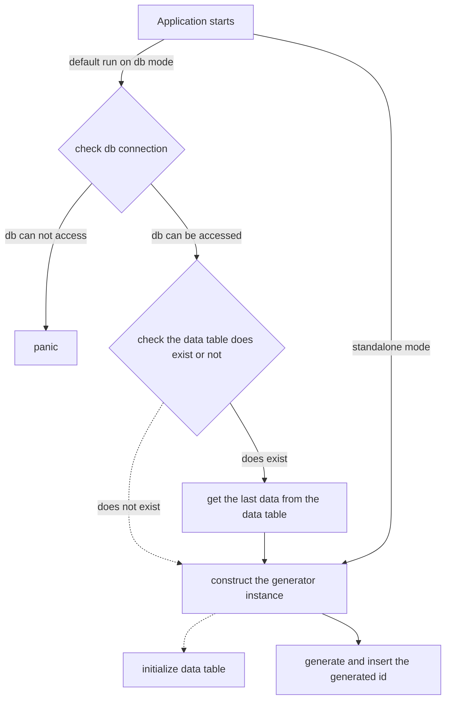

# butterfly-go

根据[此项目](https://www.yuque.com/simonalong/butterfly)而用Golang实现的一个实践库，非生产环境可用的工具库

## 大致工作原理

```mermaid
graph TD
    A[Application starts] -->|default run on db mode | B{check db connection}
    A --> |standalone mode| C[construct the generator instance]
    B --> |db can not access| D[panic]
    B --> |db can be accessed| E{check the data table does exist or not}
    E -.-> |does not exist| C
    C -.-> F[initialize data table]
    C -->H[generate and insert the generated id]
    E-->|does exist|I[get the last data from the data table]
    I-->C
```